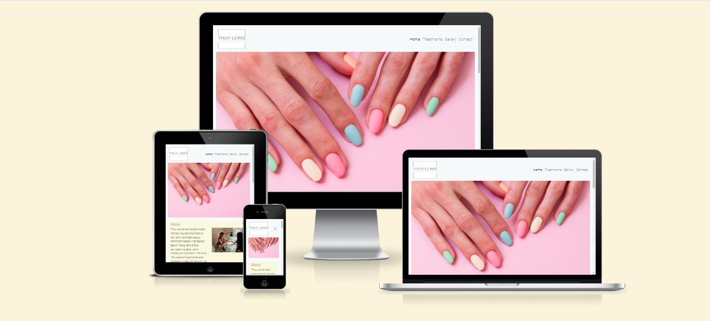
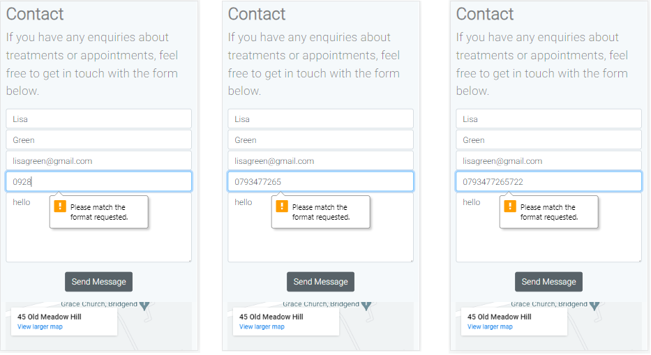
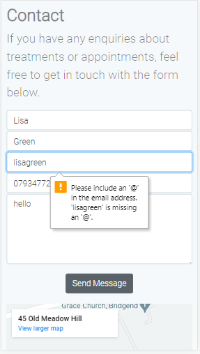
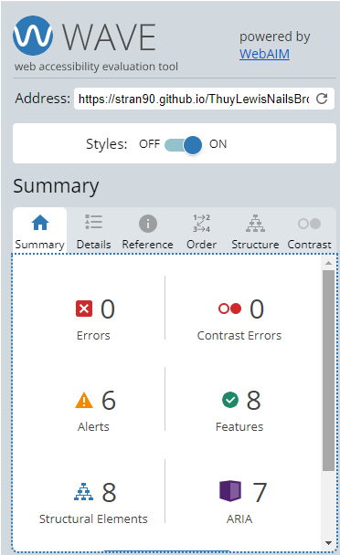

# Thuy Lewis Nails Brows & Lashes

  

## Project Overview 

**Thuy Lewis Nails Brows & Lashes**  B2C website showcasing an experienced beauty business located in Bridgend - South Wales. Thuy Lewis specialises in brows, lashes and creative nail designs using different techniques. 

I have designed the website to look professional as its main focus. It is designed to be fully responsive and accessible on a range of devices, making it easy to navigate for potential and existing customers.

The goal of the website is to provide an up-to-date picture portfolio (creative nail designs, brow and lash transformations), information about the services it delivers, and also allow an easy way for getting in touch with the business owner.

The site must meet all the requirements and goals as potential visitors will most likely be comparing other similar local services, so the final website look must stand out and show everything the user would want to see.

**Link to website** [here](https://stran90.github.io/ThuyLewisNailsBrowsAndLashes).

---

## CONTENTS

* [User Experience](#user-experience-ux)
  * [User Stories](#user-stories)

* [Design](#design)
  * [Colour Scheme](#colour-scheme)
  * [Typography](#typography)
  * [Imagery](#imagery)
  * [Wireframes](#wireframes)
  * [Features](#features)
  * [Future Implementations](#future-implementations)
  * [Accessibility](#accessibility)

* [Technologies Used](#technologies-used)
  * [Languages Used](#languages-used)
  * [Frameworks, Libraries & Programs Used](#frameworks-libraries--programs-used)

* [Testing](#testing)
  * [Manual Testing](#manual-testing)

* [Deployment & Local Development](#deployment--local-development)
  * [Deployment](#deployment)
  * [Local Development](#local-development)
    * [How to Fork](#how-to-fork)
    * [How to Clone](#how-to-clone)

* [Credits](#credits)
  * [Content](#content)
  * [Media](#media)
  * [Acknowledgments](#acknowledgments)

---

## User Experience (UX)

### User Stories

#### Target Audience

- A person looking for a qualified and insured beauty technician. 
- A person looking for someone who specialises in gel, acrylics, nail extensions and design. 
- A person looking to have their lashes tinted or lifted.
- A person looking to have their eyebrows waxed or tinted.

#### First-time Visitor Goals 
- As a first time user, I want to see short information about Thuy Lewis, and the services she provides.
- As a first time user, I want to have easy access to the all sites content by clicking the correct navigation link.
- As a first time user, I want to see portfolio containing high quality pictures showcasing recent work on customers.
- As a first time user, I want to know about customers reviews to learn about their experience, and make sure that provided services are of high quality and can be trusted. 
- As a first time user, I want to have easy access to the social media links such as Instagram, Facebook and E-Mail address.
- As a first time user, I want to be able to find information about prices.
- As a first time user, I want to be able to contact the business owner as I wish through social media, e-mail or a contact form.

#### Returning User Visitor Goals
- As a returning user, I want to be able to see updates of the owners work and any new products or services available.
- As a returning user, I want to be able to easily contact the business owner.

#### Site Owner Goals
- As the site owner, I want users to quickly know what Thuy Lewis Nails, Brows & Lashes is offering.
- As the site owner, I want users to quickly access information that will give them an idea and informed services Thuy Lewis can provide. 
- As the site owner, I want the users to be able to contact the business owner.
- As the site owner I want the users to feel that the website is professional looking and will therefore offer a professional service.

### Responsive Web Design

#### Website is fully responsive, with use of 4 breakpoints:

- 375px - mobile size,
- 768px - tablet size,
- 1440px - desktop size,
- 1950px - desktop large size.

## Design

### Colour Scheme

The website uses light pastel colours, I wanted to choose colours to reflect the creative personality of the business owner and the hero image used in the home page. 

### Typography

- [Google Fonts](https://fonts.google.com/)

  - Used 'Roboto': "light 300" font for the website as it great for accessibility.

### Imagery

Images provided by business owner Thuy Lewis.

### Wireframes
Home Page Wireframe:  

Treatment Page Wireframe:  

Gallery Page Wireframe:  

Contact Us Page Wireframe:  

  

Wireframes were created for mobile, tablet and desktop. 

### Features

The website is composed of four pages, each is accessible from the navigation menu (home page, treatments, gallery & contact page). 

All pages on the website have:

-A responsive navigation bar at the top which allows the user to navigate through the site. 

-A footer which contains social media links to Facebook and Instagram. Icons were used to keep the footer clean and because they are universally recognisable. 

* Home Page. 
  * Hero Section. 
  The hero shows an image of a popular nail design liked by clients. 
  * About Section.
  This gives users information of Thuy Lewis. On large screens an image of Thuy Lewis in action is seen and laid out in a row. However no image is seen on mobile device. 
  * Testimonials Section
  This section gives reviews from clients. On mobile these are stacked vertically, however on larger screens there can be seen an extra review and set out in rows of twos. 
  * Treatments Section
  This section shows images of treatments and a table of list of treatments. On mobile screen they are stacked vertically, however on larger screens the images are on the right side of the table of treatments. 

* Treatment Page. 
  * Hero Section. 
  The hero shows an image of a salon area. 
  * A Table of treatments and pricelist.

* Gallery Page. 
  * A different variety of current nail designs to showcase Thuy Lewis skills, including eyebrows and lashes. Two more images can be seen on the desktop browser. 

* Contact Page. 
  * A number of ways to get in touch with Thuy Lewis, address, email and phone number. 
  * Opening times. 
  * Contact form Section 
  Form to contact the business owner and map image of location of business. The form contains fields for the users name, email address, phone number and personal message they want to send to the business owner. The user submits the form using the submit button. Users must fill in the name, email, and text area fields to be able to submit the form. If they don't a tooltip will guide them to fill in any information they have missed.
  

### Future Implementations.

  * Slideshow image reel for gallery page. 
  * Send email notification to user once form has been submitted. 
  * Add favicon to website. 

### Accessibility 

I have been mindful during coding to ensure the website is as accessible friendly as possible. I have achieved this by:

* Using semantic HTML.
* Using descriptive alt attributes on images on the site. 
* Ensuring there are sufficient colour contrast throughout the site.
* Using font style with good accessibility.

---

## Technologies Used

### Languages Used

- HTML
- CSS

### Frameworks, Libraries & Programs Used

Balsamiq - Used to create wireframes. 

Bootstrap version 4.2.1 - The Framework for the website. Code used for additional CSS styling was also implemented in style.css. 

Google map generator - Was used to import business location.

[Gitpod](https://gitpod.io/) - Open source developer platform, an IDE running in the Cloud. 

[Git](https://git-scm.com/) - Version control tool for tracking changes in code.

[GitHub](https://github.com/) - Hosting service for software development and version control using Git, to save and store files for the website. 

[FontAwesome](https://fontawesome.com/) - Iconography on the website

[Lighthouse](https://developer.chrome.com/docs/lighthouse/overview/) - Used to audit the site for performance, quality, best practices and SEO.

[Am I Responsive?](https://ui.dev/amiresponsive/) - An online tool to check how responsive the website is on different devices. Screenshot generated by the tool is presented in about section of the README file.

[Markup Validation Service](https://validator.w3.org/) - Validator checks the markup validity of Web documents in HTML, XHTML, SMIL, MathML, etc.

[CSS Validation Service](https://jigsaw.w3.org/css-validator/) - Online tool validates CSS files as CSS level 3 + SVG.

Google Dev Tools - To troubleshoot and test features, solve issues with responsiveness and styling. 

[Tinypng](https://tinypng.com) - Online site to reduce the file size of your WEBP, JPEG and PNG files. 

## Testing

Testing was ongoing throughout the entire build. I utilised Google Chrome developer tools while building to pinpoint and troubleshoot any issues as I went along.
Each device has been inspected using Google Chrome developer to ensure each page is fully responsive on a variety of different screen sizes and devices. I have also physically tested the responsiveness of the site on a number of different devices. 

### Manual Testing 

#### Navigation 

Navigation's behaviour checked on every page for every responsive breakpoints (mobile, tablet, desktop, desktop-large):

* Click on the website's logo redirects to index.html.
* Click on Home link redirects to index.html.
* Click on Treatment link redirects to treatments.html.
* Click on Gallery link redirects to gallery.html.
* Click on Contact link redirects to contact.html.

Social media icons:

* All icon links have target attribute set to "_blank" and open in new tab.
* Click on Instagram icon opens new tab with Thuy Lewis Nails, Brows & Lashes profile.
* Click on Facebook icon opens new tab with Thuy Lewis Nails, Brows & Lashes profile.

#### Submit Contact Form

I tested the contact form was working as I wanted. The following steps were taken during testing:

-Press send, with no data input. A 'Please fill in this field' tooltip warning appears on the next form box to enter information. 

  

-Fill name box with data, then press send. A 'Please fill in this field' tooltip warning appears on the next form box to enter information. 

  

-Fill surname box with data, then press send. A 'Please fill in this field' tooltip warning appears on the next form box to enter information.

  

-Fill email box with data, then press send. A 'Please fill in this field' tooltip warning appears on the next form box to enter information.

  

-Tested pattern="[0-9]{11} attribute for input tel. Entered 4 digits and pressed send, tooltip warning requesting to match correct format. Entered 10 digits and pressed send, tooltip warning requesting correct format. Entered 12 digits and pressed send, tooltip warning requesting correct format.

  

-Fill phone number box with correct data, then press send. A 'Please fill in this field' tooltip warning appears on the next form box to enter information.

  

-Fill message box with data, then press send. Redirected to confirmation page that message has been sent.

  

-Tested the tooltip warning for an email to be entered correctly by putting in no @ symbol in email box.

  

### W3C Validator

The W3C validator was used to validate the HTML on all pages of the website. It was also used to validate CSS in the style.css file.

* [Index Page HTML](README.docs/Readme/html_index.png)
* [Treatments Page HTML](README.docs/Readme/html_treatments.png)
* [Gallery Page HTML](README.docs/Readme/html_treatments.png)
* [Contact Page HTML](README.docs/Readme/html_treatments.png)
* [W3C CSS Validator](README.docs/Readme/w3c_css_validator.png)

### Lighthouse

I used lighthouse to test each of the pages for:

- Performance - how the page performs whilst loading.
- Accessibility - how accessible is the site for all users and how can it be improved.
- Best practices - how does the site conform to industry best practices.
- SEO - search engine optimization. Is the site optimized for search engine result rankings.

Results can be accessed by this [link](https://pagespeed.web.dev/analysis/https-stran90-github-io-ThuyLewisNailsBrowsAndLashes/pvzas4fdj3?form_factor=mobile)

### Wave

I used wave (web accessibility evaluation tool) in chrome developer tools to test the website accessibility. Scanned website for on-page and technical accessibility issues and errors to bring site in line with recognized accessibility standards, like the Web Content Accessibility Guidelines (WCAG).

  

### Bugs

The following issues were raised during my mid project meeting with my mentor:
- Duplicate contact form on homepage and contact page.  

I removed this as if future bugs were to occur in this part of the code, there is a more likely chance of forgetting the dupicate code of the other html page and not fixing it. Saves time and future headwork. 

- Be consistent with choice of colour code.  

HEX was chosen colour code as it was easier and traditional to code and included the alpha parameter.

### Solved Bugs

1. Bug: Nav bar aligned to the right. 
   Fixed: Changed .mr-2 to .ml-auto

2. Error: Bad value 100% for attribute width on element img: Expected a digit but saw % instead.
  From line 39, column 17; to line 39, column 147

          ↩  

Fix: Removing width from img element in index.html and setting CSS rule of width=100% to thuy-lewis id attribute in the style.css. 

## Deployment & Local Development 

### Deployment

For website deployment I have decided to go with [Gitpod](https://gitpod.io) because it provides fast website load speeds, simple configuration setup and very easy deployment process.

- From the dashboard create new "Project",
- Login with GitHub,
- Import desired git repository,
- Configure project,
- Type "python3 -m http.server" into terminal 
- Select 'Open in new browser' when pop up appears. 
- Website deployed!

### Local Development 

#### How to Fork

To fork the Thuy Lewis Nails, Brows & Lashes repository:

1. Log in (or sign up) to Github.
2. Go to the repository for this project, https://github.com/STRAN90/ThuyLewisNailsBrowsAndLashes.git
3. Click the Fork button in the top right corner.

#### How to Clone

To clone the Thuy Lewis Nails, Brows & Lashes repository:

1. Log in (or sign up) to GitHub.
2. Go to the repository for this project, https://github.com/STRAN90/ThuyLewisNailsBrowsAndLashes.git
3. Click on the code button, select whether you would like to clone with HTTPS, SSH or GitHub CLI and copy the link shown.
4. Open the terminal in your code editor and change the current working directory to the location you want to use for the cloned directory.
5. Type 'git clone' into the terminal and then paste the link you copied in step 3. Press enter.

- - -

## Credits

### Content

Content for this project was written by Sonia Majewska.

###  Media

Media was provided by the business owner. 

### Acknowledgments

- My mentor Rohit Sharma for his knowledge and helpful advice. 
- Google search engine for limitless resources about web development. 